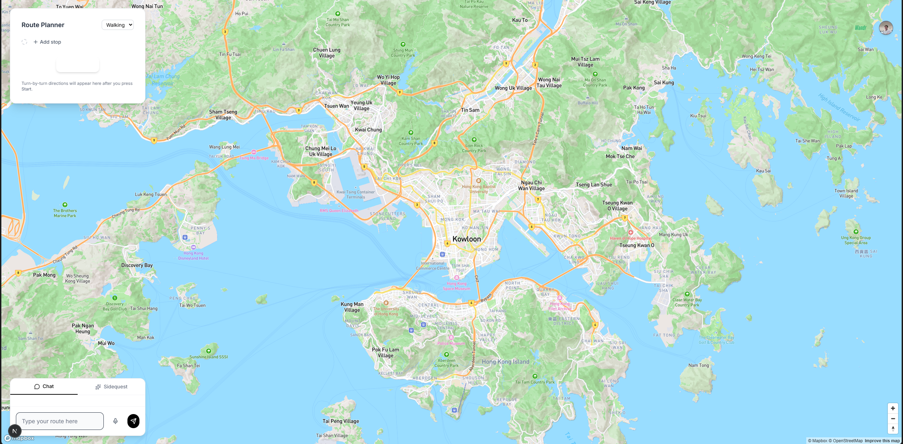

  
  
  **AI-Powered Area Intelligence & Route Planning**
  
  Natural language route planning with real-time area insights.
  
  

---

## Overview

Wandr combines natural language processing with comprehensive area analysis. Voice or text input delivers instant insights about neighborhoods, local businesses, and optimized routes.
### Demo:
https://youtu.be/sOnBBTyZX3k

  

  

---

## Key Features

### **Area Summarizer**
AI-powered location intelligence with neighborhood demographics, local business insights, and category-specific analysis. Real-time recommendations personalized to user preferences.

### **Natural Language Interface**
Voice and text input with conversational understanding. Hands-free operation with personalized location keywords.

### **Intelligent Route Planning**
Multi-stop optimization with real-time constraints. Multiple transport modes with turn-by-turn navigation and visual map integration.

### **Personalization**
Adaptive recommendations based on usage patterns. Persistent user preferences and saved locations.

---

## Technology Stack

**Frontend**  
Next.js 15 · TypeScript · Tailwind CSS · Mapbox GL · Auth0

**Backend**  
FastAPI · Python 3.11 · MongoDB · Pydantic

**AI/ML**  
Google Gemini · OpenAI GPT-4 · Whisper · Cohere · Google Places API

**Infrastructure**  
Docker · Nginx · Redis

